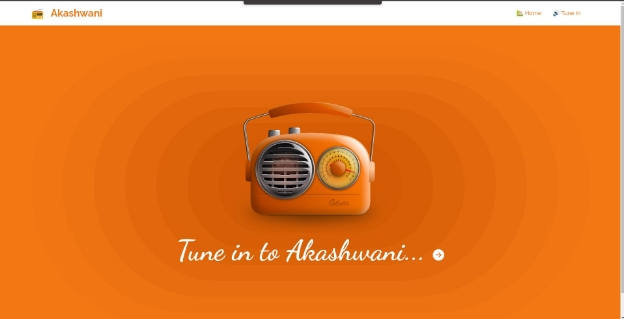
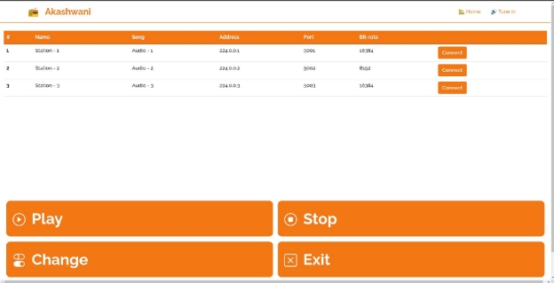



**LAB-4**

**Topic: Multicasting multimedia over IP**

**Course:** CSE342 Computer Networks **Submitted to:** Dr. Shashi Prabh

**Date of Submission:** 9th May, 2022 **Group No.: 19**

|**Name**|**Roll No**|
| - | - |
|Hirmay Sandesara|AU1940265|
|Rohan Parikh|AU1940157|
|Vinay Kakkad|AU1940012|
|Tirth Patel|AU1940137|
|Nipun Patel|AU1940033|
Table of Contents

[**Background](#_page1_x72.00_y437.08) **[2**](#_page1_x72.00_y437.08)**

[**Design Decisions which were taken by the team](#_page1_x72.00_y517.26) **[2** ](#_page1_x72.00_y517.26)[Usage of threads wherever necessary](#_page1_x72.00_y569.71)** [2 ](#_page1_x72.00_y569.71)[Storage Structure](#_page2_x72.00_y119.61) [3 ](#_page2_x72.00_y119.61)[GUI based-decisions](#_page2_x72.00_y228.24) [3](#_page2_x72.00_y228.24)

[**Features/Functions of Server](#_page2_x72.00_y429.64) **[3** ](#_page2_x72.00_y429.64)[Details of the method used to determine data rate](#_page2_x72.00_y482.08)** [3](#_page2_x72.00_y482.08)

[**Features/Functions of Client](#_page3_x72.00_y72.00) **[4**](#_page3_x72.00_y72.00)**

[Playback buffer size on the client-side](#_page3_x72.00_y169.34)

[We experienced no buffer while streaming the audio. The buffer size used was 64 KB (confirm). When we used a smaller buffer size (1KB), we experienced a lot of disturbance and garbled audio.](#_page3_x72.00_y169.34) [4](#_page3_x72.00_y169.34)

[Pause, Restart, Change, Terminate logic](#_page3_x72.00_y191.21) [4](#_page3_x72.00_y191.21)

[**Part-2 Extra Credit Client interface, GUI based](#_page3_x72.00_y452.53) **[4** ](#_page3_x72.00_y452.53)[Brief description of the GUI](#_page3_x72.00_y504.98)** [4 ](#_page3_x72.00_y504.98)[Screenshots](#_page4_x72.00_y93.16) [5](#_page4_x72.00_y93.16)

[**Contribution of team members](#_page4_x72.00_y603.76) **[5** ](#_page4_x72.00_y603.76)[References](#_page6_x72.00_y72.00) [7**](#_page6_x72.00_y72.00)**

Background

We have developed an Internet radio using IP multicast. The following report contains details of the implementation and a description of the features developed in the same.

Design Decisions which were taken by the team

Usage of threads wherever necessary

We have used the threading library of python for making a thread for different stations in the server. We have used it to make threads for different stations on the server. Threads for each and every station are called in the main thread of the server.

In the station thread, we are running an infinite loop and constantly sending the data of songs from that station. In the main thread of client code, the server is connected through TCP and another thread is created for receiving the data from the station. The data of the song is received

in this thread and stored in a queue and another thread is created for playing the data received from the server. Every station is a multicast group and each station can send data to more than one client.

Storage Structure

All the station information (consisting of station number, name, description, MCAST Address, MCAST port, info of port, bitrate) is stored in a structure 2-dimensional list in the server code, this will be converted to a string, encoded and sent to the client which will be decoded and converted back to the list via eval() function.

GUI based-decisions

We went with a flask based Graphical User Interface as it gave us a good amount of versatility as well as we had a good amount of experience in that framework. It also in theory was easier to integrate with the code that we developed.

Sending Data

We decided to go read frames and send them as bytes by encoding them and decoding them at the client side. We made this decision because finding optimal data to send for different audio was a critical challenge. By deciding to send the frames we essentially averted this problem as frame size is different for different audio.

Features/Functions of Server

Details of the method used to determine data rate

- Data rate for each audio is determined uniquely.
- We can get the number of frames in the audio file from the getFrames() method available in the wave package.
- Our server is reading and sending a 10240 number of frames every 0.001 seconds by using the readFrames() method. Thus getting an overall framerate of 10240000.
- Frame Size is different for different audios and thus we will have different bitrate or data rates for different songs depending upon their respective frame size.

Features/Functions of Client

Playback buffer size on the client-side

We experienced no buffer while streaming the audio. The buffer size used was 64 KB (confirm). When we used a smaller buffer size (1KB), we experienced a lot of disturbance and garbled audio.

Pause, Restart, Change, Terminate logic

On the client-side, we used a thread (recieveThread) to receive the audio data. In the main thread, we continuously accepted inputs from the user where he was able to pause the radio, restart it, change stations and terminate the radio.

- *Pause*: Whenever the user entered P, we terminated the receiveThread. To do so, we used a global variable that we would change to “True” if we wanted to terminate that thread. So, whenever the variable became true, we exited the receive() function. We also used a variable called isPaused to indicate whether the program is paused or not.
- *Restart*: If the radio was paused, we changed isPaused to True and restarted the recieveThread by terminating it and starting it again.
- *Change*: First we asked the user which station he wanted to switch to. After the user indicated his choice, we terminated receiveThread and started it again after setting the station equal to the input given by the user.
- *Terminate*: We terminated the radio program by simply terminating the thread, and closing the socket using the exit() function.

Part-2 Extra Credit Client interface, GUI based

Brief description of the GUI

The Graphical User Interface is used to display the list of stations available for the client to connect to and the buttons to perform Pause, Restart, Change and Exit functionality.

Screenshots

Contribution of team members

|**Team member name**|**Contribution and tasks are given**|
| - | - |
|Hirmay|- Refactoring and documenting of|

||● ● ●|
server code

Server functionalities and the description mentioned in the report Attempt towards GUI layout and design (option-1)

Station design structure (MCast grp, port, content selection)
|
| :- | - | - |
|Rohan|● ● ● ●|
Refactoring and documenting of server code

Server functionalities and the description mentioned in the report Attempt towards GUI layout and design (option-1)

Station design structure (MCast grp, port, content selection)
|
|Tirth|
● ● ●

●
|
Refactoring and documenting of server code

Server functionalities and the description mentioned in the report Attempt towards GUI layout and design (option-1)

Station design structure (MCast grp, port, content selection)
|
|Vinay|● ● ● ●|
Refactoring and documenting of client code

Server functionalities and the description mentioned in the report Attempt towards GUI layout and design (option-1)

Client-side station information integration
|
|Nipun|● ● ● ●|
Refactoring and documenting of client code

Server functionalities and the description mentioned in the report Attempt towards GUI layout and design (option-1)

Client-side station information integration
|
**Important note**: Crucial components of Client and Server code were done by all along with the necessary design decisions and assumptions coming with that logic. Apart from that debugging which is involved with the code was done equally.

References

[https://docs.python.org/3/library/socket.html ](https://docs.python.org/3/library/socket.html)[https://stackoverflow.com/a/1794373 ](https://stackoverflow.com/a/1794373)<https://people.csail.mit.edu/hubert/pyaudio/docs/>

Peterson, L. L., & Davie, B. S. (2022). *Computer Networks A Systems Approach* (4th ed.). Elsevier.

Unix Network Programming, Volume 1: The Sockets Networking API
